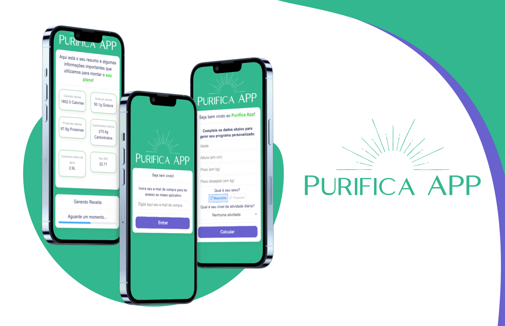

# 🥗 Purifica App

  

---

O **Purifica App** é uma aplicação web interativa focada em **nutrição personalizada**, oferecendo ao usuário recomendações diárias de calorias, macronutrientes (proteínas, carboidratos e gorduras), consumo ideal de água, além do cálculo de IMC (Índice de Massa Corporal). Com base nesses dados, o sistema também gera uma **receita personalizada** em formato PDF, de acordo com os objetivos e perfil do usuário.

---

## 📦 Funcionalidades

- 🔐 **Login do usuário** e armazenamento local seguro dos dados da consulta.
- 📊 **Cálculo automático** de:
  - Calorias diárias ideais
  - Macronutrientes (gorduras, proteínas e carboidratos)
  - Consumo ideal de água
  - IMC
- 📄 **Geração de uma receita personalizada** em PDF com base nos dados analisados.
- ⏳ Feedback visual com barra de progresso enquanto a receita é preparada.
- 📥 Opção de **download da receita** diretamente no navegador.

---

## 💡 Tecnologias Utilizadas

- **React.js** — Interface moderna e reativa
- **Bootstrap** — Componentes prontos e responsivos para o layout
- **HTML/CSS** — Estruturação e estilo personalizados
- **LocalStorage** — Armazenamento temporário de dados do usuário no navegador

---

## 🧠 Lógica de Negócio

A aplicação realiza os seguintes cálculos com base nos dados fornecidos pelo usuário:

- **IMC**: `peso / altura²`
- **Taxa Metabólica Basal (TMB)**: Fórmula de Harris-Benedict, ajustada para homens e mulheres
- **Calorias Totais**: TMB × nível de atividade física
- **Distribuição dos Macronutrientes**:
  - 60% Carboidratos
  - 25% Gorduras
  - 15% Proteínas
- **Conversão para gramas**:
  - Proteínas e Carboidratos: 4 calorias por grama
  - Gorduras: 9 calorias por grama
- **Consumo de água**: `peso × 0.035` (litros por dia)
